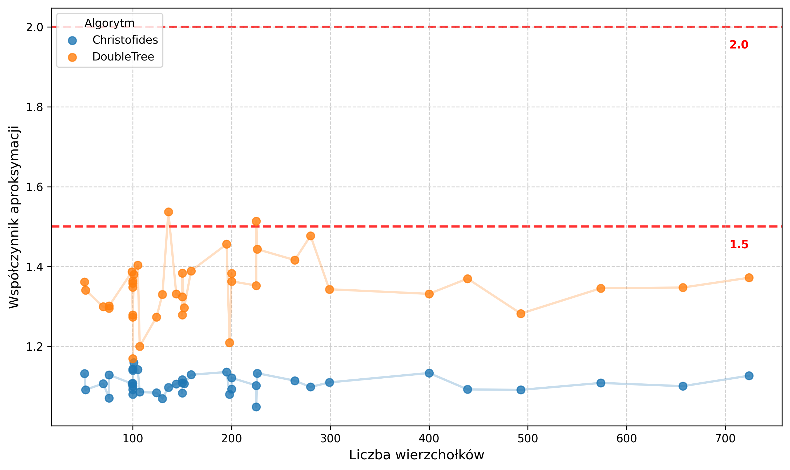
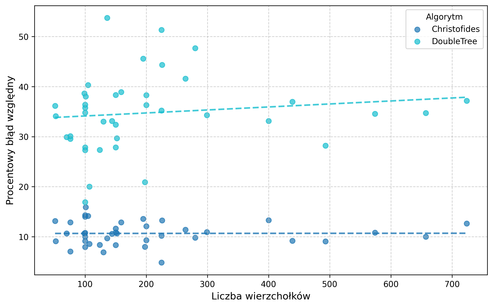
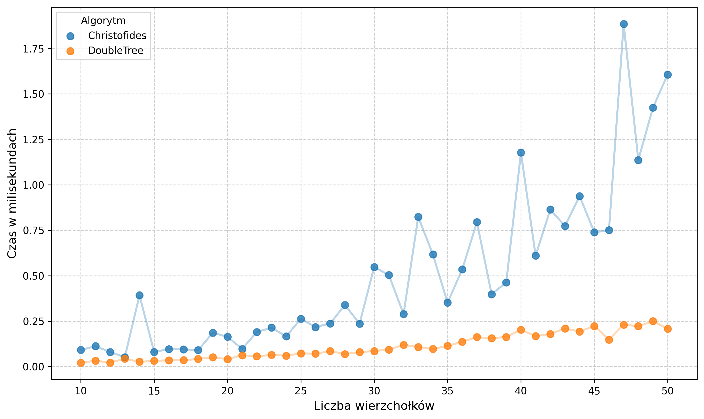
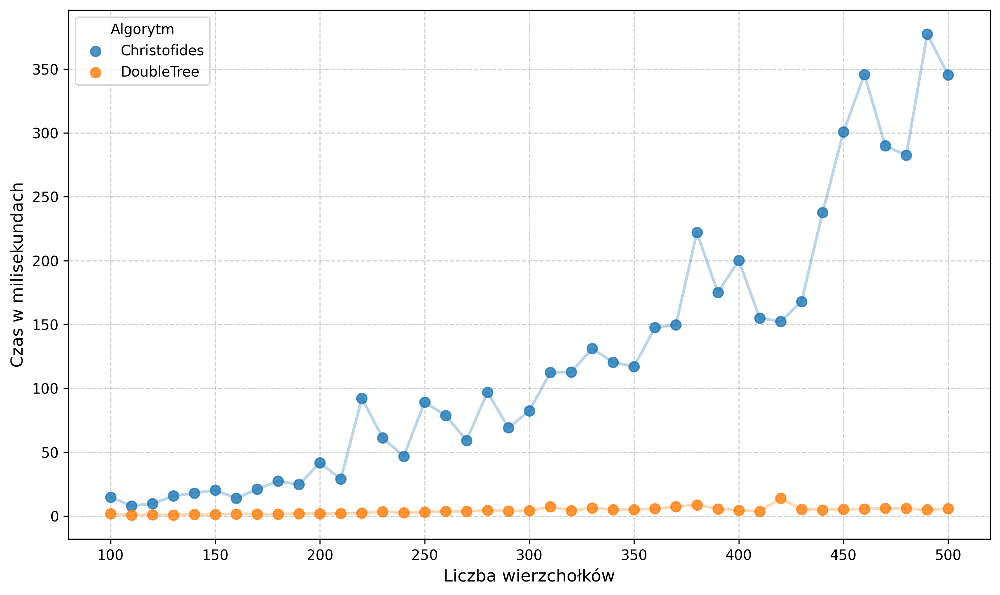
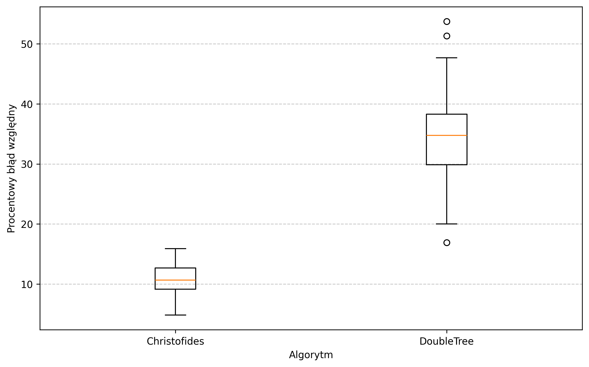

# TSP Approximation Comparison

A comprehensive implementation and performance analysis of approximation algorithms for the Metric Traveling Salesperson Problem (TSP). This project compares the classic **2-approximation (Double-Tree) algorithm** with the more sophisticated **Christofides' algorithm**, evaluating them across various instance types and sizes.

## Table of Contents

- [Introduction](#introduction)
- [Project Structure](#project-structure)
- [Algorithms](#algorithms)
- [Input and Output Specification](#input-and-output-specification)
- [Usage Guide](#usage-guide)
- [Experiments and Results](#experiments-and-results)
- [Visualizations](#visualizations)
- [Authors](#authors)

## Introduction

The Traveling Salesperson Problem is a classic NP-hard optimization problem. This project focuses on the metric version of the problem, where edge weights satisfy the triangle inequality. We provide a robust C# implementation of two key approximation algorithms to study the trade-off between solution quality (approximation ratio) and computational complexity.

## Project Structure

The project is organized into a modular C# solution located in the `src/` directory.

- **TspApproximation.sln**: Main Visual Studio solution file.
- **TspApproximation.App**: The primary console application for solving individual TSP instances.
- **TspApproximation.Core**: A shared library containing the core logic, graph data structures, and algorithm implementations.
- **TspApproximation.Generator**: A utility tool for generating random metric TSP instances of varying sizes.
- **TspApproximation.Runner**: An automation tool used for batch execution of experiments and gathering performance metrics.
- **TspApproximation.Tests**: A suite of unit tests ensuring the correctness of the algorithm implementations.

## Algorithms

### 2-approximation (Double-Tree)
This algorithm provides a solution with a cost at most twice the optimal cost (2-OPT).
- **Process**: Constructs a Minimum Spanning Tree (MST), performs a preorder traversal to create a shortcutted Hamiltonian cycle.
- **Complexity**: $O(n^2 \text{log}(n))$ using Prim's algorithm for MST construction.
- **Characteristics**: Extremely fast and scalable, but generally yields lower quality solutions.

### Christofides' Algorithm
A more advanced heuristic that guarantees a solution within 1.5 times the optimal cost (1.5-OPT).
- **Process**: Builds an MST, finds a minimum weight perfect matching for vertices with odd degrees, constructs an Eulerian circuit from the combined graph, and applies shortcuts.
- **Complexity**: $O(n^4)$ in this implementation (primarily due to the Blossom algorithm for matching).
- **Characteristics**: Provides significantly higher precision and stable performance across different topologies.

## Input and Output Specification

### Input Format
The application accepts plain text files with the following structure:
1. First line: An integer **n** representing the number of vertices.
2. Next **n** lines: An **n × n** adjacency matrix where each value represents the weight of the edge between vertices. Weights must be non-negative integers and satisfy the triangle inequality.

Example:

```text
5
0 1 2 2 1
1 0 1 2 2
2 1 0 1 2
2 2 1 0 1
1 2 2 1 0
```

### Output Format
The results are presented in a clear, standardized format:
1. **Total Distance**: The total weight of the discovered Hamiltonian cycle.
2. **Route**: The sequence of vertex identifiers separated by dashes, forming a closed loop.

Example:
```text
Total Distance: 5
Route: 0-1-2-3-4-0
```

## Usage Guide

### Solving an Instance
Run the main application providing the path to the input file. By default, it uses Christofides' algorithm.

```powershell
# Use Christofides' algorithm (default)
tsp-approximation.exe graph.txt

# Use Double-Tree algorithm with output redirection to a file
tsp-approximation.exe graph.txt 
    --double-tree 
    --output result.txt
```

### Generating Test Data
Use the generator tool to create custom datasets.

```powershell
# Generate a single 50-vertex instance
tsp-generator.exe 
    --start 50

# Generate a series of 10 instances
# starting from 100 vertices, incrementing by 10
tsp-generator.exe 
    --start 100 
    --step 10 
    --count 10 
    --dir test_instances
```

## Experiments and Results

### Methodology
The algorithms were evaluated using three distinct datasets:
- **Small Random Instances**: $n = 10~\text{to}~50$, used for detailed behavior analysis.
- **Large Random Instances**: $n = 100 ~\text{to}~500$, used for scalability testing.
- **TSPLIB Benchmarks**: Reference instances from the TSPLIB library (up to 724 vertices) with known optimal solutions to calculate exact approximation ratios.

### Performance Analysis
- **Double-Tree**: Demonstrated exceptional scalability. For $n = 500$, execution time remains nearly instantaneous (sub-millisecond).
- **Christofides**: Shows a clear polynomial growth in execution time. While efficient for small to medium graphs (~20ms for $n = 100$), it reaches ~380ms for $n = 500$.

### Solution Quality
- **Christofides**: Consistently outperformed its theoretical 1.5 bound, typically staying within 5-15% of the optimal solution. It shows no significant degradation in quality as problem size increases.
- **Double-Tree**: While faster, it produced solutions typically 20-50% worse than optimal. It exhibits higher variance and sensitivity to graph topology.

## Visualizations

### Approximation Quality
The following plot shows the empirical approximation ratio for TSPLIB instances compared to the theoretical limits (red dashed lines).



### Size-Error Correlation
Analysis of the correlation between the number of vertices and the approximation error, showing the stability of the algorithms as problem size increases.



### Computational Complexity
Comparison of execution times for both algorithms on random instances. The plots illustrate the different growth rates: stable sub-millisecond performance for Double-Tree versus the polynomial growth of Christofides' algorithm.

#### Small Random Instances (n = 10 to 50)


#### Large Random Instances (n = 100 to 500)


### Distribution of Relative Error
Boxplots illustrating the distribution of relative errors for both algorithms across all benchmark instances.



## Authors

- [Marcin Cieszyński](https://github.com/Zumi002)
- [Radosław Głasek](https://github.com/1180779)
- [Adam Grącikowski](https://github.com/adamgracikowski)

Developed as part of the *Advanced Algorithms* course at Warsaw University of Technology.
